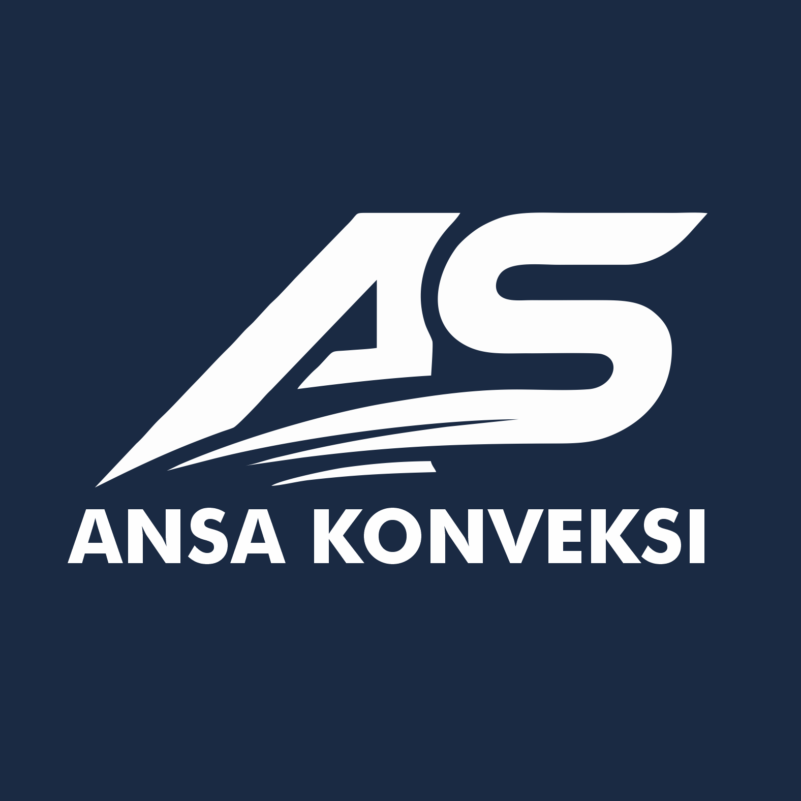

<div align="center">
  
  
  # ANSA Konveksi
  
  **Solusi Konveksi Terpercaya untuk Kebutuhan Anda**
  
  [](https://nextjs.org/)
  [](https://reactjs.org/)
  [](https://www.typescriptlang.org/)
  [](https://tailwindcss.com/)
  
  [🌐 Kunjungi Website](https://ansakonveksi.com) | [📧 Hubungi Kami](https://ansakonveksi.com#contact)
</div>

---

## 🎯 Tentang Website

**ANSA Konveksi** adalah website company profile modern yang menyediakan layanan konveksi berkualitas tinggi untuk berbagai kebutuhan, termasuk:

- 👕 **Kaos Custom** - Desain sesuai keinginan Anda
- 🧥 **Jaket & Hoodie** - Kualitas premium dan nyaman
- 👔 **Seragam Kantor** - Profesional dan elegan
- ⚽ **Jersey Olahraga** - Untuk tim dan komunitas
- 🎒 **Merchandise** - Produk promosi berkualitas

Website ini dibangun dengan teknologi modern untuk memberikan pengalaman pengguna yang optimal, responsif, dan interaktif.

---

## ✨ Fitur Utama

### 🎨 **Desain Modern & Responsif**
- Tampilan yang menarik dengan animasi GSAP
- Fully responsive untuk semua perangkat (mobile, tablet, desktop)
- Dark mode support dengan tema yang konsisten

### 📸 **Galeri Produk Interaktif**
- Showcase produk dengan gambar berkualitas tinggi
- Filter dan kategori produk yang mudah dinavigasi
- Lightbox untuk melihat detail produk

### 💬 **Testimoni Pelanggan**
- Review dari pelanggan yang puas
- Rating dan feedback yang transparan

### 📱 **WhatsApp Widget**
- Tombol WhatsApp floating untuk kemudahan komunikasi
- Langsung terhubung dengan customer service

### ❓ **FAQ Section**
- Pertanyaan yang sering diajukan
- Accordion UI untuk navigasi yang mudah

### 🚀 **Cara Pemesanan**
- Step-by-step guide untuk memesan
- Proses yang jelas dan mudah dipahami

### 🏢 **Informasi Perusahaan**
- Tentang kami dan visi misi
- Alasan memilih ANSA Konveksi
- Daftar klien yang telah bekerja sama

---

## 🛠️ Tech Stack

Website ini dibangun menggunakan teknologi terkini:

| Technology | Version | Purpose |
|-----------|---------|---------|
| **Next.js** | 16.1.1 | React framework dengan SSR & SSG |
| **React** | 19.2.3 | UI library untuk komponen interaktif |
| **TypeScript** | 5.x | Type-safe JavaScript |
| **Tailwind CSS** | 4.x | Utility-first CSS framework |
| **GSAP** | 3.14.2 | Animasi dan interaksi yang smooth |
| **Radix UI** | Latest | Komponen UI yang accessible |
| **Lucide React** | 0.562.0 | Icon library yang modern |

---

## 🌐 Akses Website

Website ini dapat diakses secara online di:

### 🔗 **[https://ansakonveksi.com](https://ansakonveksi.com)**

> Website ini sudah live dan dapat diakses 24/7 untuk melihat produk, portofolio, dan menghubungi kami.

---

## 💻 Development

### Prerequisites

Pastikan Anda sudah menginstall:
- **Node.js** (v18 atau lebih tinggi)
- **npm**, **yarn**, **pnpm**, atau **bun**

### Installation

```bash
# Clone repository
git clone <repository-url>

# Masuk ke direktori project
cd pandawakonveksi

# Install dependencies
npm install
# atau
yarn install
# atau
pnpm install
```

### Running Development Server

```bash
npm run dev
# atau
yarn dev
# atau
pnpm dev
# atau
bun dev
```

Buka [http://localhost:3000](http://localhost:3000) di browser untuk melihat hasilnya.

### Build for Production

```bash
npm run build
npm run start
```

---

## 📂 Struktur Project

```
pandawakonveksi/
├── app/                      # Next.js App Router
│   ├── layout.tsx           # Root layout
│   ├── page.tsx             # Homepage
│   └── globals.css          # Global styles
├── src/
│   └── components/
│       ├── sections/        # Section components
│       │   ├── HeroSection.tsx
│       │   ├── OurProductsSection.tsx
│       │   ├── GallerySection.tsx
│       │   ├── TestimonialSection.tsx
│       │   ├── FaqSection.tsx
│       │   ├── HowToOrderSection.tsx
│       │   ├── WhyChooseUsSection.tsx
│       │   ├── ClientSection.tsx
│       │   ├── Navbar.tsx
│       │   └── Footer.tsx
│       └── ui/              # Reusable UI components
│           └── WhatsAppWidget.tsx
├── public/
│   └── image/
│       └── logo/            # Logo files
│           └── logo03.png
└── package.json
```

---

## 🎨 Fitur Desain

- **Animasi Smooth**: Menggunakan GSAP untuk transisi dan animasi yang halus
- **Glassmorphism**: Efek kaca modern pada beberapa komponen
- **Gradient Colors**: Palet warna yang harmonis dan menarik
- **Micro-interactions**: Hover effects dan feedback visual yang responsif
- **Typography**: Font Google (GFS Didot, Geist) untuk tampilan yang premium

---

## 📞 Kontak

Untuk pertanyaan, pemesanan, atau kerjasama, silakan kunjungi:

- 🌐 Website: [https://ansakonveksi.com](https://ansakonveksi.com)
- 💬 WhatsApp: Tersedia di website (klik tombol WhatsApp)
- 📧 Email: Informasi tersedia di halaman kontak

---

## 📄 License

© 2026 ANSA Konveksi. All rights reserved.

---

<div align="center">
  <p>Dibuat dengan ❤️ menggunakan Next.js dan React</p>
  <p><strong>ANSA Konveksi - Solusi Konveksi Terpercaya</strong></p>
</div>
